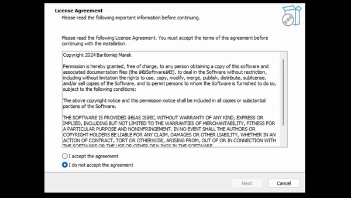

# Typing Test Application

## About the Project
This client-side application, developed in Python and utilizing the Kivy framework along with the pynput library, serves as a typing testing tool with a **focus on tracking and analyzing typing errors**.

Designed for research purposes, this application collects detailed data on typing patterns, including every keystroke and error, to explore the potential of identifying or verifying individuals through behavioral biometrics related to typing behavior.

### The user should be aware that each keystroke is gathered in the background.  
### The user consents to the collection of this data by using the application and confirming the consent at the start of the application.

### Purpose
The primary goal of this project is to gather comprehensive data on user typing behavior, specifically focusing on errors made during typing tests. By analyzing this data, we aim to contribute to research in the field of behavioral biometrics, exploring the feasibility of using typing patterns as a method of identification or verification.

### Features
- Keystroke Tracking: Utilizes the pynput library to monitor and record every keystroke, ensuring detailed data collection.
- Research-Oriented Data Collection: Collects typing data in a format that is useful for behavioral biometrics research.
- Predefined Texts and Sentences: Offers a variety of texts for users to type, designed to capture a broad range of typing behaviors and patterns.

### Installation guide
Please install using installation file: [Installer](TypeMe-1.0-setup.exe)

For a detailed installation and usage guide, watch the video here: 

### Disclaimer
This application is intended for research purposes only. It transparently informs users about the data collection process related to their typing behavior. By using this application, users consent to the collection and analysis of their typing data for the stated research objectives.

